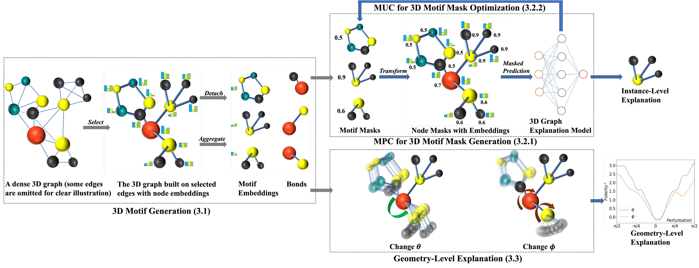

<p align="center">
<h1 align="center">3DGraphX: Explaining 3D Molecular Graph Models via Incorporating Chemical Priors (KDD 2025)</h1>

<p align="center">
    <a href="https://dl.acm.org/doi/10.1145/3690624.3709302"></a>
    <a href="https://github.com/xufliu/3DGraphX/blob/main/LICENSE"></a>
</p>



## Setup Environment

This is an example for how to set up a working conda environment to run the code.

```shell
conda create -n graphx3d python=3.9
conda activate graphx3d

```


## Citations

Feel free to cite this work if you find it useful to you!

```
@inproceedings{liu20253dgraphx,
  title={3DGraphX: Explaining 3D Molecular Graph Models via Incorporating Chemical Priors},
  author={Liu, Xufeng and Luo, Dongsheng and Gao, Wenhan and Liu, Yi},
  booktitle={Proceedings of the 31st ACM SIGKDD Conference on Knowledge Discovery and Data Mining V. 1},
  pages={859--870},
  year={2025}
}
```
